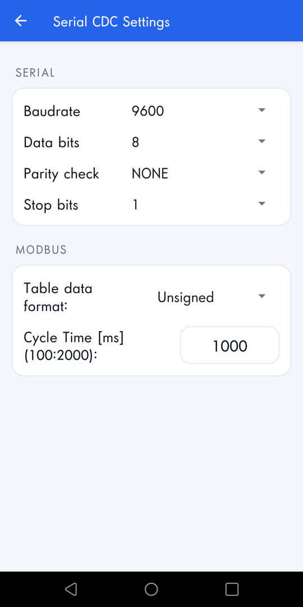
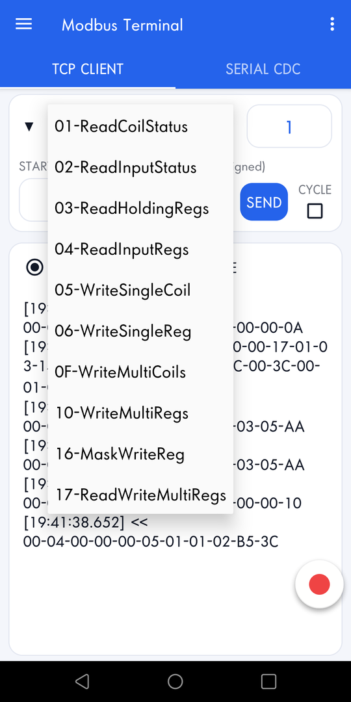
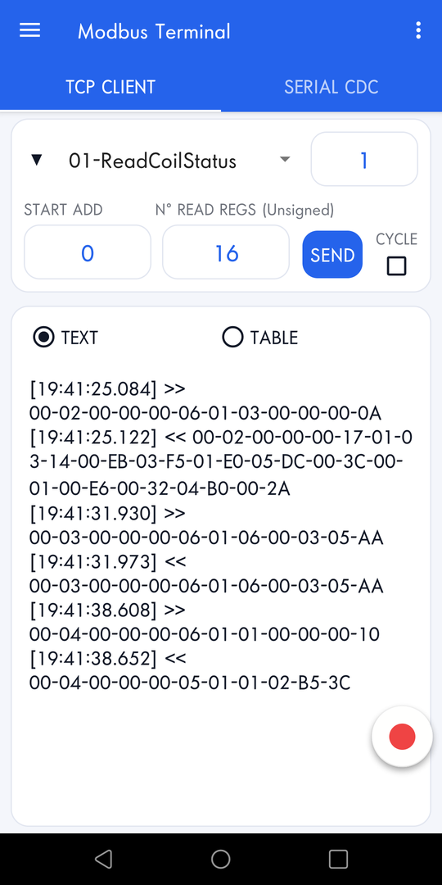
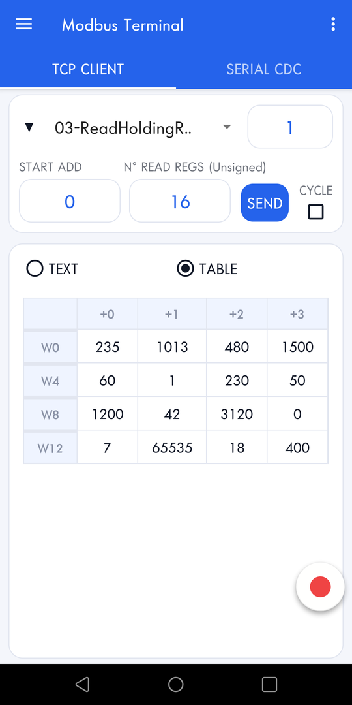
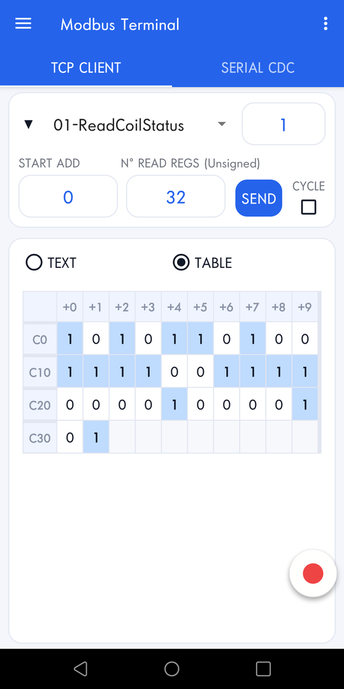

# Modbus Terminal


## What is Modbus Terminal?

Modbus Terminal is a Modbus master for Android: it reads and writes registers and coils of PLCs, inverters, energy meters and any other Modbus slave, over Modbus TCP (Wi-Fi/Ethernet) or Modbus RTU through a USB-serial adapter.

You can download it from Google Play here:
* [Modbus Terminal](https://play.google.com/store/apps/details?id=com.edodm85.modbusterminal)

&nbsp;
&nbsp;


## Features

- Modbus TCP client and Modbus RTU over USB serial (USB OTG)
- Function codes 01, 02, 03, 04, 05, 06, 0F, 10, 16, 17
- Values in decimal (unsigned) or hexadecimal
- Raw frame console or table view with the address of every register and coil
- Modbus exceptions decoded by name, timeouts and incomplete responses reported
- Requests checked against the limits of the Modbus specification before sending
- Console with time, date or timestamp, and log recording to a text file
- The connection stays open in the background
- Light and dark theme, English and Italian
- No ads: cyclic send (polling every 100–2000 ms) is an optional one-time in-app purchase

&nbsp;
&nbsp;


## Supported USB-serial adapters

FTDI, Prolific PL2303, CH340/CH341 and USB CDC-ACM devices. Baud rate from 1200 to 921600, 7/8 data bits, parity None/Odd/Even/Mark/Space, 1/1.5/2 stop bits.

&nbsp;
&nbsp;


## How does it work?

1. Set the server IP address and port in *TCP Settings* and press CONNECT, or for Modbus RTU set the serial parameters in *Serial Settings*, plug the USB-serial adapter and press OPEN.

<p align="left">

</p>

2. Choose the function code, the unit ID, the start address and the quantity (or the values to write, separated by "/") and press SEND.

<p align="left">


</p>


3. Read the response as raw frames in the console, or as a table of registers and coils.

<p align="left">


</p>

&nbsp;
&nbsp;


## Hardware for Modbus RTU

Android phones have no serial port, so Modbus RTU needs a USB-serial adapter connected through USB OTG (with a USB-C adapter or OTG cable if the phone has a different connector). Choose the adapter according to the electrical interface of the slave:

- **RS-485** (most PLCs, inverters and energy meters): a USB to RS-485 adapter, wired A/B (D+/D-) and GND.
- **RS-232**: a USB to RS-232 adapter (DB9).
- **TTL / UART** (microcontrollers, Arduino, ESP32, development boards): a USB to TTL adapter, for example the [Waveshare FT232 USB-C to TTL](https://www.amazon.it/dp/B09F3196FB). Cross TX/RX and share GND, and check that the voltage (3.3 V or 5 V) matches the board.

TTL levels are not RS-232 levels: never connect a TTL adapter directly to an RS-232 port.

&nbsp;
&nbsp;


## Testing without a real device

You can try the app with [ModbusTools](https://github.com/serhmarch/ModbusTools), a free and open-source Modbus simulator for Windows and Linux (tested with version 0.5.0). Its `mbserver` acts as a Modbus slave:

1. Download the release for your system and start `mbserver`.
2. Create a TCP port (default port 502) and a device with the unit ID you want to use, then press the green *Run* button: the server does not start until you do.
3. Connect the phone to the same Wi-Fi network as the PC, enter the PC IP address and port in *TCP Settings* and press CONNECT.

Tips:
- The port has an idle *Timeout* (3000 ms by default) after which mbserver closes connections with no traffic. Raise it in the port settings (with the server stopped) if the connection drops while you are not sending requests.
- Allow `mbserver` through the Windows firewall, otherwise the phone cannot reach it.
- For Modbus RTU, create an RTU port on the COM port of a second USB-serial adapter connected to the PC and use the same serial parameters (baud rate, data bits, parity, stop bits) on both sides:

```
 Android phone          adapter 1                 adapter 2          PC
+-----------+  OTG   +-----------+             +-----------+  USB  +-----------+
|  Modbus   |========|        TX |-------------| RX        |=======| mbserver  |
|  Terminal |        |        RX |-------------| TX        |       | RTU port  |
|           |        |       GND |-------------| GND       |       | on COMx   |
+-----------+        +-----------+             +-----------+       +-----------+
```

With two RS-485 adapters connect A to A, B to B and GND to GND instead.

&nbsp;
&nbsp;


## Payload format

| Function | Payload field |
|---|---|
| 01, 02, 03, 04 (read) | quantity, e.g. `10` |
| 05 Write Single Coil | `0` or `1` |
| 06 Write Single Register | value, e.g. `1450` (negative values like `-1` are allowed) |
| 0F Write Multiple Coils | values separated by "/", e.g. `1/0/1/1` |
| 10 Write Multiple Registers | values separated by "/", e.g. `100/200/300` |
| 16 Mask Write Register | `andMask/orMask`, e.g. `240/5` |
| 17 Read/Write Multiple Registers | `readQuantity/writeAddress/value1/value2/...`, e.g. `3/30/7/8` |

In the settings you can choose whether addresses and values are written in decimal or in hexadecimal (`0x` prefix optional).


## License

> Copyright (C) 2026 edodm85.  
> Licensed under the Apache License, Version 2.0.  
> (See http://www.apache.org/licenses/LICENSE-2.0 for the whole license text.)
